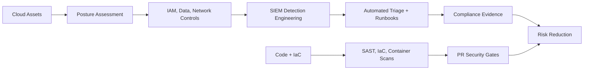

<!--
  GitHub Profile README — Ahmed Raza Shaikh
  Profile repo: github.com/ahmed-raza-shaikh/ahmed-raza-shaikh

  Setup:
  1. Rename or create the profile repository as: ahmed-raza-shaikh
  2. Place this file at the repository root as README.md
-->

# Ahmed Raza Shaikh

**Cloud Security Engineer | Cybersecurity Consultant | DevSecOps Automation**

---

## About

- Cloud Security Engineer and cybersecurity consultant with 5+ years securing enterprise cloud, financial services, and client environments.
- Focused on AWS and Azure security posture, SIEM detection engineering, VAPT, IAM hardening, DevSecOps gates, and compliance programs.
- Experienced across PCI-DSS, SOX, ISO 27001, NIST CSF, NIST SP 800-53, OWASP Top 10, MITRE ATT&CK, STRIDE, and Zero Trust architecture.
- Building automation for cloud compliance, vulnerability management, threat detection, and security reporting.
- Reach me at [ahmedshaikh0426@gmail.com](mailto:ahmedshaikh0426@gmail.com).

---

## Cybersecurity Stack

### Cloud Security

### Detection, VAPT & AppSec

### DevSecOps & Automation

---

## Security Focus

<table>
  <tr>
    <td align="center" width="180">
      
       
      <b>AWS Security Posture</b>
    </td>
    <td align="center" width="180">
      
       
      <b>Azure Detection</b>
    </td>
    <td align="center" width="180">
      
       
      <b>Container Security</b>
    </td>
    <td align="center" width="180">
      
       
      <b>Security Automation</b>
    </td>
  </tr>
</table>

---

## Security Operating Model

---

## GitHub Stats

