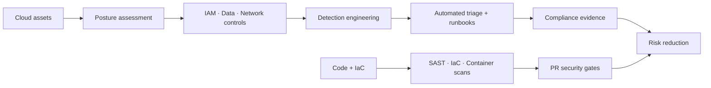

<!--
THESIS: A cloud-security profile as an operational signal brief, not a generic tool wall.
OWN-WORLD: Midnight signal field; cobalt and teal routes with restrained amber evidence markers; crisp dividers and purposeful tables.
STORY: Recruiters see practical security impact; collaborators see the systems, standards, and problems worth building together.
FIRST VIEWPORT: A full-width signal banner precedes a direct role statement, three compact contact actions, and a one-line operating thesis.
FORM: An evidence-led field brief (assigned direction, seed 8f9035fc), paced from signal to scope to proof to collaboration.
-->

  

  # Ahmed Raza Shaikh

  **Cloud Security Engineer · Cybersecurity Consultant · DevSecOps Automation**

  I build the connective tissue between cloud posture, detection engineering, secure delivery, and evidence-ready compliance.

  [LinkedIn](https://www.linkedin.com/in/ahmedrazaashaikh/) · [Portfolio](https://ahmedshaikh.cloud/) · [Email](mailto:ahmedshaikh0426@gmail.com)

---

## Signal brief

Cloud security engineer and cybersecurity consultant with 5+ years securing enterprise cloud, financial-services, and client environments. My work moves from *finding risk* to *making it harder to reintroduce*—across IAM, cloud controls, SIEM detection, application security, and delivery pipelines.

<table>
  <tr>
    <td width="33%"><b>01 / Protect</b> AWS and Azure posture, IAM hardening, data and network controls.</td>
    <td width="33%"><b>02 / Detect</b> Actionable SIEM content, threat-informed telemetry, and response runbooks.</td>
    <td width="33%"><b>03 / Prove</b> Automated guardrails, continuous evidence, and defensible compliance reporting.</td>
  </tr>
</table>

---

## The work in numbers

| Signal | Outcome |
| :-- | --: |
| Cloud-risk reduction | **60%** |
| SIEM detection rules engineered | **65+** |
| High-severity findings stopped in CI/CD | **200+** |
| CVEs managed through vulnerability programs | **600+** |

---

## Security operating model

```mermaid
flowchart LR
    A["Cloud assets"] --> B["Posture assessment"]
    B --> C["IAM · Data · Network controls"]
    C --> D["Detection engineering"]
    D --> E["Automated triage + runbooks"]
    E --> F["Compliance evidence"]
    F --> G["Risk reduction"]

    H["Code + IaC"] --> I["SAST · IaC · Container scans"]
    I --> J["PR security gates"]
    J --> G
```

---

## Capability map

| Domain | Working focus |
| :-- | :-- |
| **Cloud security** | AWS, Azure, Security Hub, GuardDuty, Microsoft Sentinel, Defender for Cloud |
| **Detection & response** | Splunk, QRadar, threat detection engineering, triage workflows, incident-ready runbooks |
| **Vulnerability & AppSec** | VAPT, Burp Suite, Nessus, Qualys, OWASP ZAP, OWASP Top 10 |
| **Secure delivery** | Python, Terraform, Docker, Kubernetes, GitHub Actions, Trivy, Snyk, Checkov |
| **Risk & assurance** | PCI-DSS, SOX, ISO 27001, NIST CSF, NIST SP 800-53, MITRE ATT&CK, STRIDE, Zero Trust |

---

## How I think about security

> Security is strongest when the control, the detection, and the evidence all tell the same story.

- **Design for reduction, not theater.** Prioritize the paths that materially reduce attack surface and response time.
- **Put guardrails where change happens.** Shift checks into infrastructure and pull-request workflows while preserving developer momentum.
- **Turn signals into decisions.** Detection is valuable only when its owners know what to do next.
- **Make assurance continuous.** Compliance evidence should be a byproduct of good engineering, not a recurring manual scramble.

---

## Open to building

I enjoy collaborating on practical security automation, cloud-compliance tooling, developer-first guardrails, and detection content that teams can actually run. If you are building in that space—or looking for someone who can connect security strategy to the work of shipping software—let’s talk.

[Start a conversation](mailto:ahmedshaikh0426@gmail.com) · [See my portfolio](https://ahmedshaikh.cloud/) · [Connect on LinkedIn](https://www.linkedin.com/in/ahmedrazaashaikh/)

 

